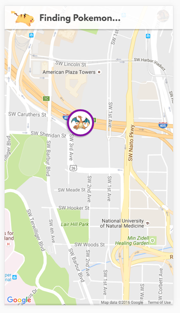
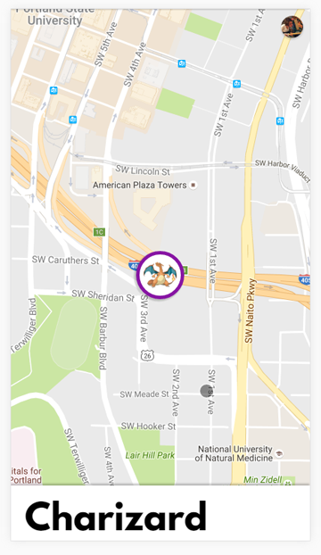
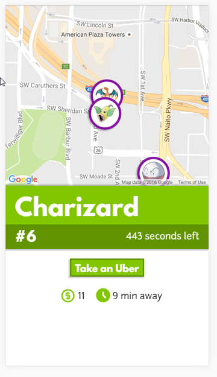

<h3>Our Product:</h3>

Pokemon Go is essentially a mobile geocaching game that replaces the traditional geocaching stations with live, randomly regenerated Pokemon.  A user playing this game explores his/her nearby area, looking for Pokemon to catch and add to their collection. Currently the in game mechanism for tracking these Pokemon is buggy and poorly designed.

Introducing...

<h4>POKEDASH</h4>

PokeDash aims to solve this problem and enhance one's game play experience by making it easier for a player to locate and obtain the coolest Pokemon around.

<h3>How does it work?</h3>
This application consists of four microservices.
<h4>PokeScan</h4>
~~Extracts live data from game servers to locate all the Pokemon near a person's geolocation~~
 
Generates a random Pokemon from the Pokedex, giving the Pokemon a random location and time to live. Niantic's recent antics made the original function of PokeScan too difficult to figure out. (This will likely be investigated further at a later time.)
<h4>PokeUber</h4>
Uses Uber's API to calculate the travel time and cost of reaching each nearby Pokemon from a person's current location
<h4>PokeRank</h4>
An intricate ranking algorithm that accounts for travel time, cost, and Pokemon awesomeness to create a prioritized list of which Pokemon one should pursue first
<h4>PokeRest</h4>
A stateless Rest Gateway that self-registers with Consul and acts as the entry point to the above 3 services.

Together, along with a gorgeous front end, the final product is a visual representation of all nearby Pokemon, color-coded based on priority level, that one can interact with to call an Uber so that he/she can catch them all.

<h3>Purpose</h3>
Ultimately, this project serves as a proof of concept to demonstrate the power, efficacy, and efficiency of Service Fabric as a platform for microservices

<h3>Technologies Used</h3>

Microsoft Service Fabric

Consul

MS Paint

<h3>Screenshots</h3>
   
